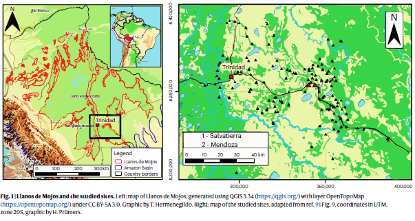

# ANT388C Applied Data Analysis

## Methods Exploration Project

### Stella and Mauricio

#### Abstract

This project is implemented by Stella and Mauricio with the intention to explore new R analysis methods with public available data. For this case we have chosen an interesting archaeological research article from Bolivian Amazon. Our intention to prove the capacity of R to create new analysis using quantitative data and ploting it as dynamic exercises within our collaborative method exploration project for Applied Data Analysis class.

#### About the dataset

![This article is an interesting case of archaeological scholarship that combines the introduction of new data in agriculture and animal domestication to sustain the importance of the Amazonian Anthropogenic Landscapes within the Human and Ecological history of the Americas. The data presented in this article are new measures of stable carbon and nitrogen Isotopes from 86 human and 68 animals remains dated around \~CE 700 and 1400 from the Llanos de Mojos, Bolivia. This data sustain the presence of maize agriculture and evidences of muscovy duscks (Cairina moschata) domestication with early dates from CE 800. ](images/clipboard-1550559432.png)



Key words: maize agriculture, animal management, low-density urbanism

Used Analysis:

- ANOVA and Krustkal-Wallis

- Shapiro-Wilk Assuption testing

#### The problem

Introduction

#### Chosen methods

what is this method?

##### Bayesian isotopic niche modeling (SIBER) with {SIBER} {SIBER=""}

This module introduces Bayesian isotopic niche modeling using SIBER to compare dietary niches across species and through time, demonstrating how ecologists and archaeologists can make robust inferences from small, noisy datasets.

When should be used

How can Bayesian methods be used to estimate and compare dietary niches when sample sizes are small and uncertainty is high?

Why does it matter

#### The data

Where it comes from

What variables matter

Analytical workflow: step by step, concrete interpretation

##### Install and load required packages

```{r}

#Packages and Libraries

library(tidyverse)
library(SIBER)
library(usethis)
library(readxl)
library(viridis)
library(RColorBrewer)
library(gridExtra)

# Random seed for full reproducibility of MCMC chains

set.seed(42)
```

##### Data preparation

```{r}

prepare_isotope_data <- function(data, group, community, iso_c = "d13C", iso_n = "d15N") {
  out <- data %>%
    dplyr::select({{group}}, {{community}}, {{iso_c}}, {{iso_n}})%>%
    dplyr::rename(
      group = {{group}}, 
      community = {{community}},
      isso1 = {{iso_c}},
      iso2 = {{iso_n}}
    )%>%
    dplyr::filter(!is.na(iso1), !is.na(iso2))
  return(out)
    
}
```

##### Fit the Bayesian niche model

```{r}

fit_siber_model <- function(siber_data) {
  siber_obj <- SIBER::createSiberObject(siber_data)
  priors <- list(
    R = list(V = diag(2), nu = 2),
    k = 2,
    tau.mu = 1e-3
  )
  
  mcmc <- list(
    n.iter = 2e4,
    n.burnin = 1e3,
    n.thin = 10,
    n.chains = 2
  )
  
  fit<- SIBER::siberMVN(
    siber_obj,
    parms = priors,
    n.iter = mcmc$n.iter,
    n.burnin = mcmc$n.burnin,
    n.thin = mcmc$n.thin,
    n.chains = mcmc$n.chains
  )
  
  return(list(model = fit, siber_object = siber_obj))
}
```

##### Plot and interpret niches (optimal but very strong)

```{r}

plot_siber_niches <- function(siber_object) {
  SIBER::plotSiberObject(
    siber_object,
    group.hulls = FALSE,
    ellipses = TRUE,
    iso.order = c(1,2)
  )
}
```

##### Datasets

Convert the project into a package

```{r}

usethis::use_data(humans_iso, fauna_iso, overwrite = TRUE)
```

#### The results

Plots

Patterns

Assumptions and limitations

#### Conclusion

When this method is useful and when not
