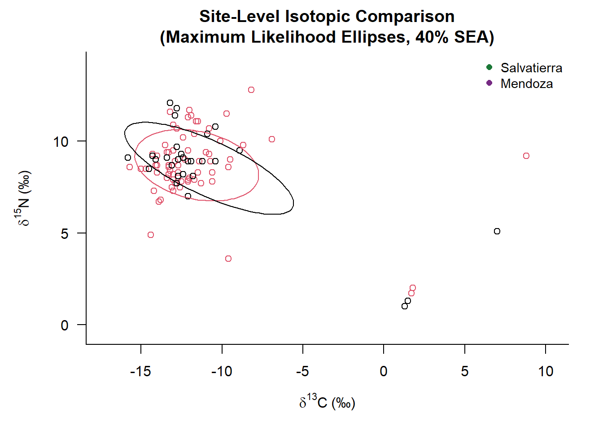
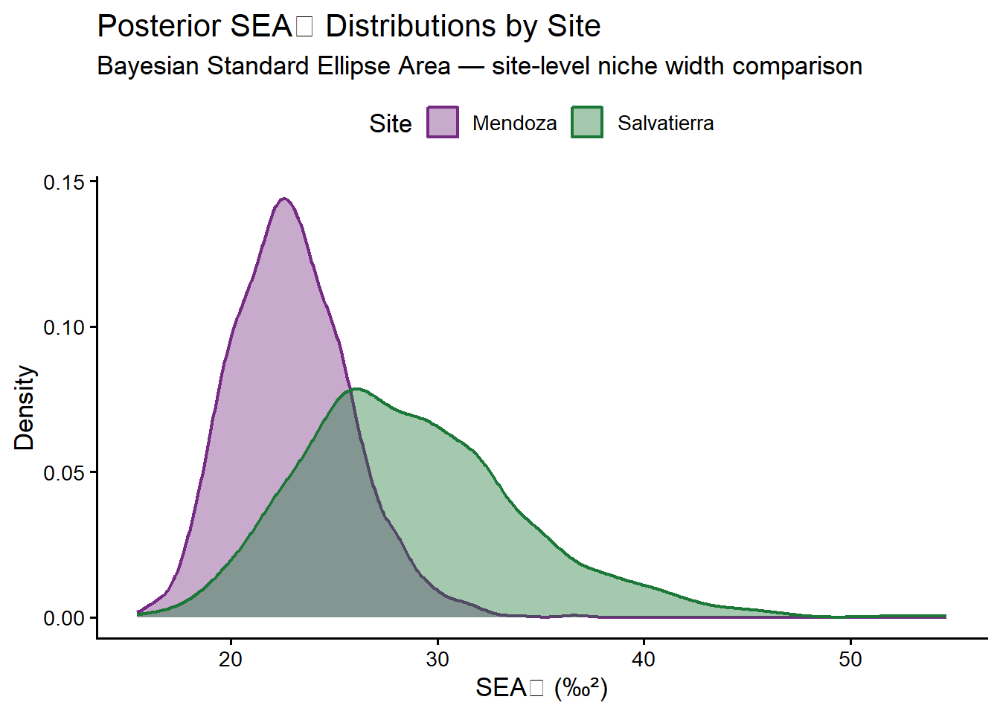
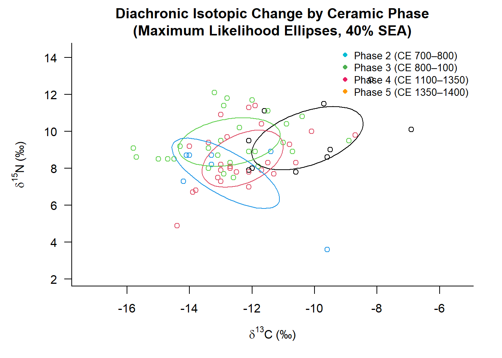
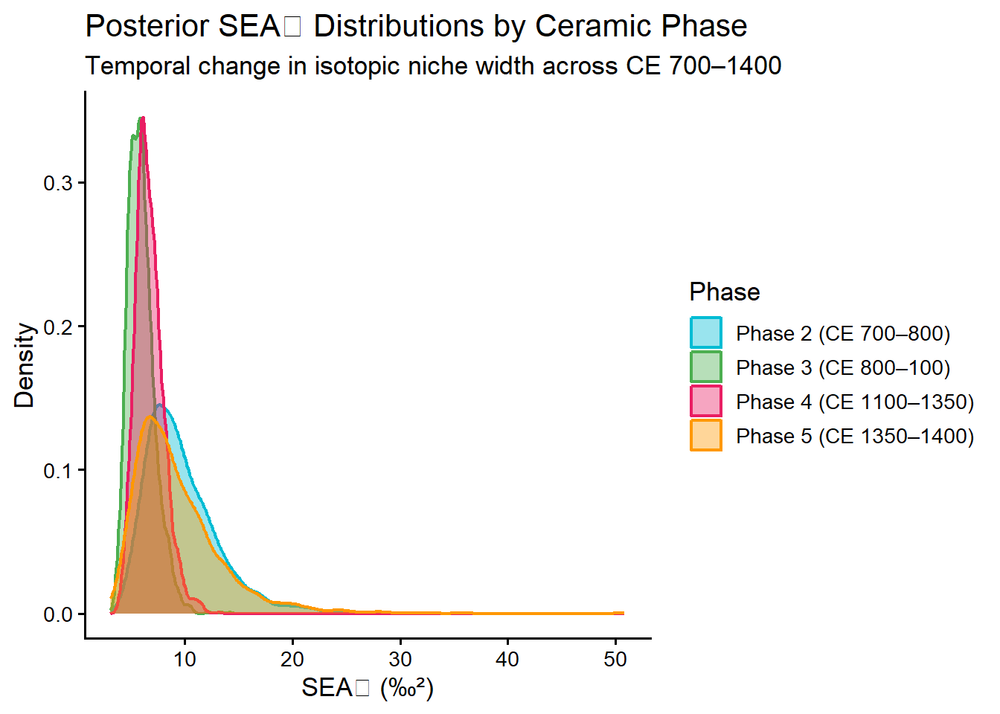
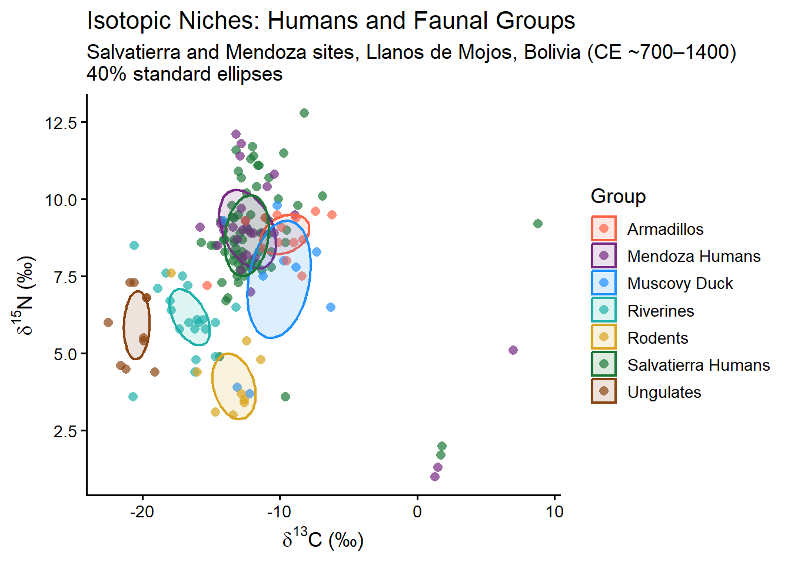
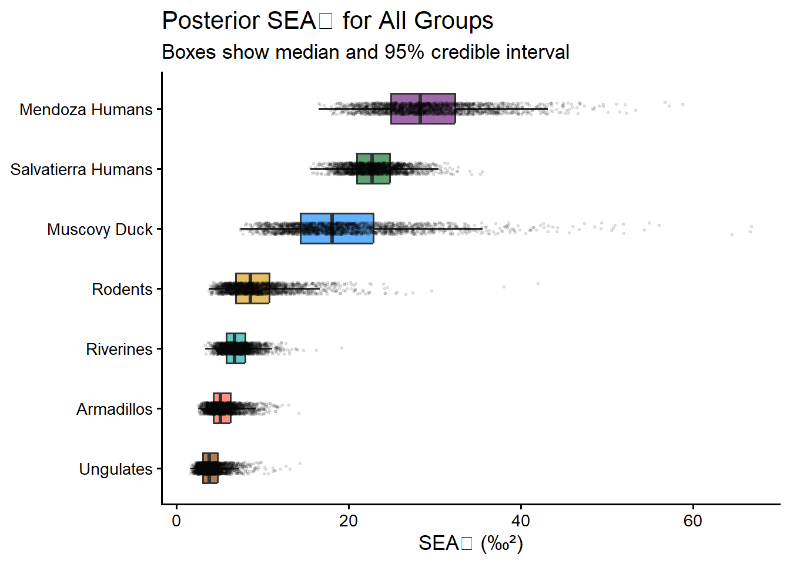
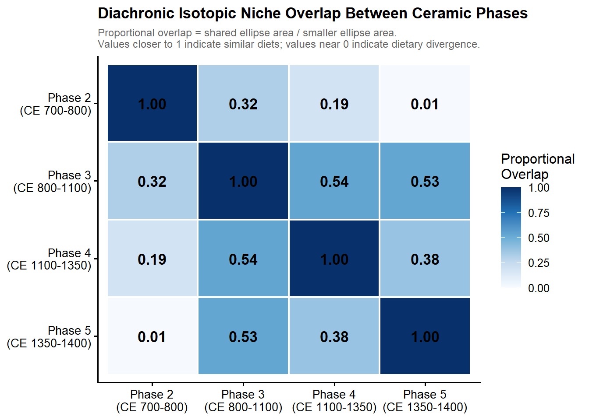
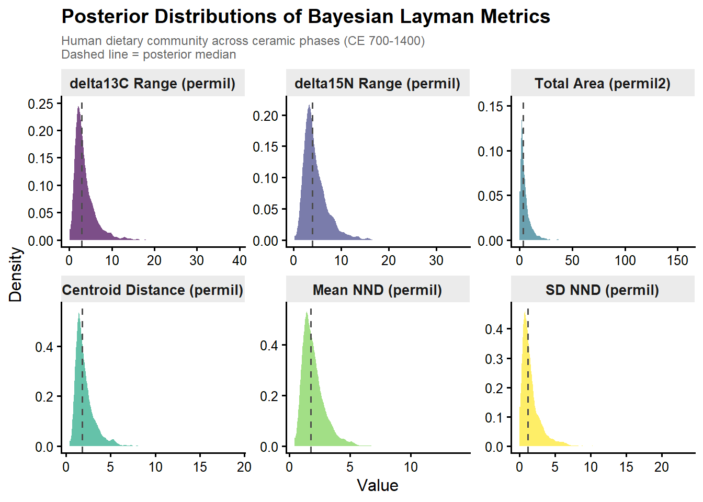
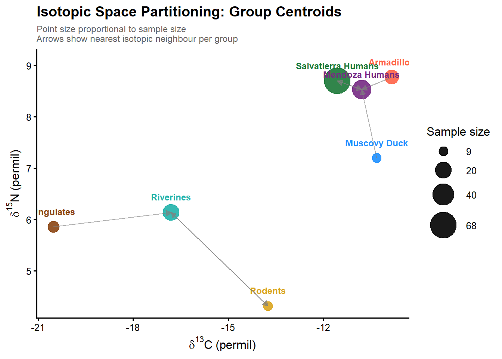
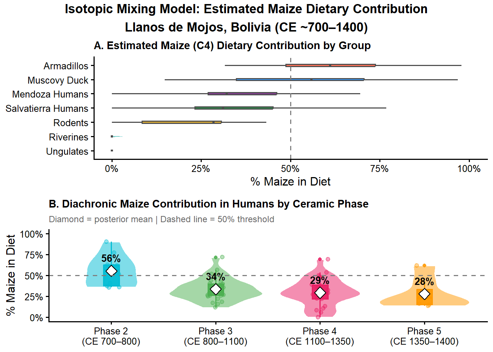

# ANT388C Applied Data Analysis

## Methods Exploration Project

### Stella and Mauricio

#### Abstract

This project is implemented by Stella and Mauricio with the intention to explore new R analysis methods with public available data. For this case we have chosen an interesting archaeological research article from Bolivian Amazon. Our intention to prove the capacity of R to create new analysis using quantitative data and ploting it as dynamic exercises within our collaborative method exploration project for Applied Data Analysis class.

#### About the dataset

![This article is an interesting case of archaeological scholarship that combines the introduction of new data in agriculture and animal domestication to sustain the importance of the Amazonian Anthropogenic Landscapes within the Human and Ecological history of the Americas. The data presented in this article are new measures of stable carbon and nitrogen Isotopes from 86 human and 68 animals remains dated around \~CE 700 and 1400 from the Llanos de Mojos, Bolivia. This data sustain the presence of maize agriculture and evidences of muscovy duscks (Cairina moschata) domestication with early dates from CE 800. ](images/clipboard-1550559432.png)


Key words: maize agriculture, animal management, low-density urbanism

Used Analysis:

- ANOVA and Krustkal-Wallis

- Shapiro-Wilk Assuption testing

#### The problem

Find innovative ways to analyze specific cases based on small and noisy datasets. Archaeological research reports several observations from diverse data that most of times does not show regular patterns or relations between them. In this case, the exploration of quantitative datasets helps us to establish correlations between different variables in order to foster interpretations on ancient human behavior and change.

#### Chosen methods

what is this method?

##### Bayesian isotopic niche modeling (SIBER) with {SIBER} and Kmeans Hclust {SIBER=""}

This module introduces Bayesian isotopic niche modeling using SIBER to compare dietary niches across species and through time, demonstrating how ecologists and archaeologists can make robust inferences from small, noisy datasets.

##### When should be used

SIBER is the appropriate tool when you need to **characterise and compare dietary or ecological niches** from stable isotope data (δ¹³C and δ¹⁵N) across multiple groups simultaneously. It is especially well suited for archaeological and ecological studies where sample sizes are small and unequal, uncertainty needs to be explicitly quantified, and classical approaches like convex hulls or t-tests would either be biased or unable to answer the research question.

The core innovation of SIBER is replacing single-point niche estimates with **full posterior distributions** over all plausible ellipse sizes and shapes given the observed data. It does this through three mechanisms:

**Small-sample correction:** The inverse-Wishart prior on the covariance matrix regularises extreme estimates when n is small, producing stable and interpretable ellipses even with as few as 9 observations — something classical convex hulls and maximum likelihood ellipses cannot do reliably.

**Uncertainty quantification:** Rather than asking "is group A's niche larger than group B's?" as a binary question, SIBER answers "in what fraction of posterior draws is A's ellipse area larger than B's?" — a direct probability statement that honestly reflects how much the data actually support the comparison.

**Propagation of uncertainty:** All downstream quantities — ellipse overlap, Layman community metrics, centroid distances — inherit uncertainty from the ellipse parameters, meaning conclusions about niche differences are automatically hedged by the precision of the underlying estimates.

##### Why does it matter

At the **methodological level**, SIBER transformed isotopic ecology from univariate mean comparisons to two-dimensional niche characterisation, and the Bayesian framework made that characterisation honest about its own limitations when data are sparse.

At the **practical level**, implementing SIBER in a fully reproducible R script within a Quarto vignette means the analysis can be independently verified, extended with new data, and adapted to future excavations across the southern Amazon without redesigning the workflow from scratch.

In short, SIBER matters because it is the only method that can simultaneously characterise dietary niches, compare them across groups with unequal and small sample sizes, and communicate the uncertainty in those comparisons in a statistically principled way — all of which are non-negotiable requirements for credible dietary reconstruction in archaeology and ecology.

#### Analytical workflow: step by step, concrete interpretation

##### Install and load required packages

```{r}

#Packages and Libraries

library(tidyverse)
library(SIBER)
library(usethis)
library(readxl)
library(viridis)
library(RColorBrewer)
library(gridExtra)
library(rjags)

# Random seed for full reproducibility of MCMC chains

set.seed(42)
```

##### Data preparation

To facilitate the data management and analysis, it is necessary

```{r}

#datasets from csv data

sal<- "https://raw.githubusercontent.com/jmv3867/CollaborativeDataScienceProject_Stella-Mauricio/refs/heads/main/data/Salvatierra.csv"

men<- "https://raw.githubusercontent.com/jmv3867/CollaborativeDataScienceProject_Stella-Mauricio/refs/heads/main/data/Mendoza.csv"

fau<- "https://raw.githubusercontent.com/jmv3867/CollaborativeDataScienceProject_Stella-Mauricio/refs/heads/main/data/Fauna.csv"

```

Let's read the dataset

```{r}

sal_raw <- read_csv(sal, col_names = TRUE)

men_raw <- read_csv(men, col_names = TRUE)

fau_raw <- read_csv(fau, col_names = TRUE)

#Let's check the datasets
glimpse(sal_raw)
glimpse(men_raw)
glimpse(fau_raw)

```

##### Clean and prepare human data

```{r}

rename_iso <- function(df) {
  df %>%
    rename(
      d13C= `?13C mean`,
      d15N= `?15N mean`,
      phase= `Ceramic Phase`
    )%>%
    filter(!is.na(d13C), !is.na(d15N))%>%
    select(`Sample Code`, Unit, phase, d13C, d15N, site)
}

sal_clean <- sal_raw %>%
  mutate(site = "Salvatierra", 
         Unit = as.character(Unit))%>%
  rename_iso()

men_clean <- men_raw%>%
  mutate(site = "Mendoza", 
         Unit = as.character(Unit))%>%
  rename_iso()

humans <- bind_rows(sal_clean, men_clean)

```

##### Clean and prepare faunal data

```{r}

fau_clean <- fau_raw %>%
  rename(
    d13C = `?13C mean`,
    d15N = `?15N mean`,
    taxa = Taxa
  ) %>%
  filter(!is.na(d13C), !is.na(d15N)) %>%
  
  filter(!`Sample Code` %in% c("SAF39", "SAF61", "SAF50", "SAF56")) %>%
  mutate(taxa = str_to_title(str_trim(taxa))) %>%
  mutate(
    group = case_when(
      taxa %in% c("Deer", "Tapir")                        ~ "Ungulates",
      taxa %in% c("Agouti", "Capybara")                   ~ "Rodents",
      taxa %in% c("9 Band Armadillo", "6 Band Armadillo") ~ "Armadillos",
      taxa == "Muscovy Duck"                               ~ "Muscovy Duck",
      taxa %in% c("Swamp Eel", "Lungfish Eel", "Caiman")  ~ "Riverines",
      TRUE                                                 ~ "Other"
    )
  ) %>%
  filter(group != "Other")

# Verify group sizes
fau_clean %>% count(group)
```

##### Prepare Phase-Based Human Subsets

```{r}

humans_phase <- humans %>%
  filter(phase %in% c("2", "3", "4", "5")) %>%
  mutate(phase = factor(phase, levels = c("2", "3", "4", "5")))
 
# Sample sizes per phase
humans_phase %>% count(phase)
```

##### SIBER Analysis - Part A: Site-Level Comparison (Salvatierra and Mendoza humans)

Build a SIBER object

```{r}

#Build SIBER object

siber_sites_df <- humans %>%
  mutate(
    iso1 = d13C,
    iso2 = d15N,
    group = site, 
    community = "humans"
  )%>%
  select(iso1, iso2, group, community)

siber_sites <- createSiberObject(siber_sites_df)
```

Visualize raw data with maximum likelihood ellipses

```{r}

site_colors <- c("Salvatierra" = "#1b7837", "Mendoza" = "#762a83")

par(mfrow = c(1, 1), mar = c(5, 5, 3, 2))
plotSiberObject(
  siber_sites,
  ax.pad    = 1.5,
  hulls     = FALSE,
  ellipses  = TRUE,
  group.hulls = FALSE,
  bty       = "L",
  iso.order = c(1, 2),
  xlab      = expression(delta^13*C~"(\u2030)"),
  ylab      = expression(delta^15*N~"(\u2030)"),
  main      = "Site-Level Isotopic Comparison\n(Maximum Likelihood Ellipses, 40% SEA)"
)
legend("topright",
       legend = names(site_colors),
       col    = site_colors,
       pch    = 16, bty = "n", cex = 0.9)
```

Fit Bayesian ellipses via MCMC

```{r}

parms <- list(
  n.iter   = 10000,   # total MCMC iterations per chain
  n.burnin = 1000,    # discarded burn-in iterations
  n.thin   = 10,      # thinning interval
  n.chains = 2        # number of independent MCMC chains
)

priors <- list(
  R     = 1 * diag(2),   # scale matrix for Wishart prior
  k     = 2,             # degrees of freedom (minimum for 2D)
  tau.mu = 1.0E-3        # precision of the normal prior on the mean
)

ellipses_sites <- siberMVN(siber_sites, parms, priors)
```

Extract posterior SEA_B areas

```{r}


SEA_B_sites <- siberEllipses(ellipses_sites)

cat("Group order in SEA_B matrix:\n")
print(siber_sites$group.names)

colnames(SEA_B_sites) <- c("Mendoza", "Salvatierra")

SEA_B_sites_summary <- apply(SEA_B_sites, 2, function(x) {
  c(
    mean   = mean(x),
    median = median(x),
    lower  = quantile(x, 0.025),
    upper  = quantile(x, 0.975)
  )
})
cat("\nPosterior SEA_B summary (‰²):\n")
print(round(t(SEA_B_sites_summary), 3))
```

Plot posterior SEA_B distributions

```{r}

SEA_B_sites_long <- as.data.frame(SEA_B_sites) %>%
  pivot_longer(everything(), names_to = "Site", values_to = "SEA_B")
 
p_sites_sea <- ggplot(SEA_B_sites_long, aes(x = SEA_B, fill = Site, color = Site)) +
  geom_density(alpha = 0.4, linewidth = 0.8) +
  scale_fill_manual(values  = site_colors) +
  scale_color_manual(values = site_colors) +
  labs(
    title    = "Posterior SEA\u2099 Distributions by Site",
    subtitle = "Bayesian Standard Ellipse Area — site-level niche width comparison",
    x        = "SEA\u2099 (\u2030\u00b2)",
    y        = "Density"
  ) +
  theme_classic(base_size = 13) +
  theme(legend.position = "top")
 
print(p_sites_sea)
```

Probability that Salvatierra SEA_B \> Mendoza SEA_B

```{r}

prob_sal_gt_men <- mean(SEA_B_sites[, "Salvatierra"] > SEA_B_sites[, "Mendoza"])
cat(sprintf(
  "\nP(SEA_B Salvatierra > SEA_B Mendoza) = %.3f\n", prob_sal_gt_men
))
```

##### SIBER Analysis - Part B: Diachronic Phases (Ceramic phases 2-5 across both sites)

```{r}

phase_colors <- c(
  "2" = "#00BCD4",   # cyan  (Phase 2, earliest)
  "3" = "#4CAF50",   # green (Phase 3)
  "4" = "#E91E63",   # pink  (Phase 4)
  "5" = "#FF9800"    # orange (Phase 5, latest)
)
 
phase_labels <- c(
  "2" = "Phase 2 (CE 700\u2013800)",
  "3" = "Phase 3 (CE 800\u2013100)",
  "4" = "Phase 4 (CE 1100\u20131350)",
  "5" = "Phase 5 (CE 1350\u20131400)"
)

siber_phase_df <- humans_phase %>%
  mutate(
    iso1      = d13C,
    iso2      = d15N,
    group     = as.character(phase),
    community = "humans"
  ) %>%
  select(iso1, iso2, group, community)
 
siber_phase <- createSiberObject(siber_phase_df)

par(mfrow = c(1, 1), mar = c(5, 5, 3, 2))
plotSiberObject(
  siber_phase,
  ax.pad    = 1.5,
  hulls     = FALSE,
  ellipses  = TRUE,
  group.hulls = FALSE,
  bty       = "L",
  iso.order = c(1, 2),
  xlab      = expression(delta^13*C~"(\u2030)"),
  ylab      = expression(delta^15*N~"(\u2030)"),
  main      = "Diachronic Isotopic Change by Ceramic Phase\n(Maximum Likelihood Ellipses, 40% SEA)"
)
legend("topright",
       legend = phase_labels,
       col    = unname(phase_colors),
       pch    = 16, bty = "n", cex = 0.85)

ellipses_phase <- siberMVN(siber_phase, parms, priors)

SEA_B_phase <- siberEllipses(ellipses_phase)
 
cat("Phase order in SEA_B matrix:\n")
print(siber_phase$group.names)
 
colnames(SEA_B_phase) <- paste0("Phase_", c("2", "3", "4", "5"))
 
SEA_B_phase_summary <- apply(SEA_B_phase, 2, function(x) {
  c(
    mean   = mean(x),
    median = median(x),
    lower  = quantile(x, 0.025),
    upper  = quantile(x, 0.975)
  )
})
cat("\nPosterior SEA_B summary by phase (‰²):\n")
print(round(t(SEA_B_phase_summary), 3))

SEA_B_phase_long <- as.data.frame(SEA_B_phase) %>%
  pivot_longer(everything(), names_to = "Phase", values_to = "SEA_B") %>%
  mutate(Phase = str_replace(Phase, "Phase_", ""))
 
p_phase_sea <- ggplot(SEA_B_phase_long, aes(x = SEA_B, fill = Phase, color = Phase)) +
  geom_density(alpha = 0.4, linewidth = 0.8) +
  scale_fill_manual(values  = phase_colors, labels = phase_labels) +
  scale_color_manual(values = phase_colors, labels = phase_labels) +
  labs(
    title    = "Posterior SEA\u2099 Distributions by Ceramic Phase",
    subtitle = "Temporal change in isotopic niche width across CE 700\u20131400",
    x        = "SEA\u2099 (\u2030\u00b2)",
    y        = "Density",
    fill     = "Phase", color = "Phase"
  ) +
  theme_classic(base_size = 13) +
  theme(legend.position = "right")
 
print(p_phase_sea)

phase_pairs <- combn(colnames(SEA_B_phase), 2, simplify = FALSE)
cat("\nPairwise posterior probabilities P(row > col):\n")
for (pair in phase_pairs) {
  p <- mean(SEA_B_phase[, pair[1]] > SEA_B_phase[, pair[2]])
  cat(sprintf("  P(%s > %s) = %.3f\n", pair[1], pair[2], p))
}
```

##### SIBER Analysis - Part C: Human and Faunal Groups

```{r}

group_colors <- c(
  "Salvatierra Humans" = "#1b7837",
  "Mendoza Humans"     = "#762a83",
  "Ungulates"          = "#8B4513",
  "Rodents"            = "#DAA520",
  "Armadillos"         = "#FF6347",
  "Muscovy Duck"       = "#1E90FF",
  "Riverines"          = "#20B2AA"
)

humans_for_combined <- humans %>%
  mutate(
    iso1      = d13C,
    iso2      = d15N,
    group     = paste(site, "Humans"),
    community = "combined"
  ) %>%
  select(iso1, iso2, group, community)
 
fau_clean <- fau_clean %>%
  mutate(
    d13C      = as.numeric(d13C),
    d15N      = as.numeric(d15N)
  )%>%
  filter(!is.na(d13C), !is.na(d15N))

humans <- humans %>%
  mutate(
    d13C = as.numeric(d13C),
    d15N = as.numeric(d15N)
  )%>%
  filter(!is.na(d13C), !is.na(d15N))


humans_for_combined <- humans %>%
  mutate(
    iso1 = as.numeric(d13C),
    iso2 = as.numeric(d15N),
    group = paste(site, "Humans"),
    community = "combined"
  )%>%
  select(iso1, iso2, group, community)

fauna_for_combined <- fau_clean %>%
  mutate(
    iso1 = as.numeric(d13C),
    iso2 = as.numeric(d15N),
    group = group,
    community = "combined"
  )%>%
  select(iso1, iso2, group, community)

siber_combined_df <- bind_rows(humans_for_combined, fauna_for_combined)
    
#
siber_combined_df %>% count(group)
 
siber_combined <- createSiberObject(siber_combined_df)

ellipses_combined <- siberMVN(siber_combined, parms, priors)
 
SEA_B_combined <- siberEllipses(ellipses_combined)
 
cat("Group order in combined SEA_B matrix:\n")
print(siber_combined$group.names)
 


group_names <- as.character(siber_combined$group.names[[1]])
cat("Group names:\n")
print(group_names)
colnames(SEA_B_combined) <- group_names
 
SEA_B_combined_summary <- apply(SEA_B_combined, 2, function(x) {
  c(
    mean   = mean(x),
    median = median(x),
    lower  = quantile(x, 0.025),
    upper  = quantile(x, 0.975)
  )
})
cat("\nPosterior SEA_B summary for all groups (‰²):\n")
print(round(t(SEA_B_combined_summary), 3))

plot_df <- siber_combined_df %>%
  rename(d13C = iso1, d15N = iso2)
 
p_combined <- ggplot(plot_df, aes(x = d13C, y = d15N, color = group, fill = group)) +
  geom_point(alpha = 0.7, size = 2.5, shape = 16) +
  stat_ellipse(
    level = 0.40,          # 40% ellipse replicating the paper's standard
    geom  = "polygon",
    alpha = 0.15,
    linewidth = 0.8
  ) +
  scale_color_manual(values = group_colors) +
  scale_fill_manual(values  = group_colors) +
  labs(
    title    = "Isotopic Niches: Humans and Faunal Groups",
    subtitle = "Salvatierra and Mendoza sites, Llanos de Mojos, Bolivia (CE ~700\u20131400)\n40% standard ellipses",
    x        = expression(delta^13*C~"(\u2030)"),
    y        = expression(delta^15*N~"(\u2030)"),
    color    = "Group", fill = "Group"
  ) +
  theme_classic(base_size = 13) +
  theme(legend.position = "right")
 
print(p_combined)

SEA_B_combined_long <- as.data.frame(SEA_B_combined) %>%
  pivot_longer(everything(), names_to = "Group", values_to = "SEA_B")
 
p_combined_box <- ggplot(SEA_B_combined_long, aes(x = reorder(Group, SEA_B, median),
                                                   y = SEA_B,
                                                   fill = Group)) +
  geom_boxplot(alpha = 0.7, outlier.shape = NA, width = 0.5) +
  geom_jitter(width = 0.1, alpha = 0.08, size = 0.5) +
  scale_fill_manual(values = group_colors) +
  coord_flip() +
  labs(
    title    = "Posterior SEA\u2099 for All Groups",
    subtitle = "Boxes show median and 95% credible interval",
    x        = NULL,
    y        = "SEA\u2099 (\u2030\u00b2)"
  ) +
  theme_classic(base_size = 13) +
  theme(legend.position = "none")
 
print(p_combined_box)
```

##### Ellipse Overlap Analysis

```{r}
# Labels for siber_combined use "combined.Group Name" format
# as confirmed by diagnostics
pairs_to_compare <- list(
  c("combined.Muscovy Duck",       "combined.Armadillos"),
  c("combined.Salvatierra Humans", "combined.Muscovy Duck"),
  c("combined.Salvatierra Humans", "combined.Mendoza Humans")
)

cat("\n--- Maximum Likelihood Ellipse Overlap ---\n")
for (pair in pairs_to_compare) {
  ov <- maxLikOverlap(
    ellipse1     = pair[1],
    ellipse2     = pair[2],
    siber.object = siber_combined,
    p.interval   = 0.40,
    n            = 100
  )
  # ov is a named numeric vector — use ["name"] not $name
  cat(sprintf(
    "%s vs %s:\n  overlap = %.3f | ellipse1 = %.3f | ellipse2 = %.3f\n\n",
    str_remove(pair[1], "combined\\."),
    str_remove(pair[2], "combined\\."),
    ov["overlap"],
    ov["area.1"],
    ov["area.2"]
  ))
}
 
```

##### Descriptive Summary Statistics

```{r}

# Human summary by site
cat("\n--- Human Isotope Summary by Site ---\n")
humans %>%
  group_by(site) %>%
  summarise(
    n          = n(),
    mean_d13C  = round(mean(d13C), 2),
    sd_d13C    = round(sd(d13C),   2),
    mean_d15N  = round(mean(d15N), 2),
    sd_d15N    = round(sd(d15N),   2),
    .groups    = "drop"
  ) %>%
  print()
 
# Human summary by phase
cat("\n--- Human Isotope Summary by Ceramic Phase ---\n")
humans_phase %>%
  group_by(phase) %>%
  summarise(
    n          = n(),
    mean_d13C  = round(mean(d13C),          2),
    sd_d13C    = round(sd(d13C),            2),
    median_d13C = round(median(d13C),       2),
    iqr_d13C   = round(IQR(d13C),          2),
    mean_d15N  = round(mean(d15N),          2),
    sd_d15N    = round(sd(d15N),            2),
    .groups    = "drop"
  ) %>%
  print()
 
# Faunal summary by ecological group
cat("\n--- Fauna Isotope Summary by Ecological Group ---\n")
fau_clean %>%
  group_by(group) %>%
  summarise(
    n          = n(),
    mean_d13C  = round(mean(d13C), 2),
    sd_d13C    = round(sd(d13C),   2),
    mean_d15N  = round(mean(d15N), 2),
    sd_d15N    = round(sd(d15N),   2),
    .groups    = "drop"
  ) %>%
  print()

```

##### Diachronic Bayesian Niche Overlap Between Ceramic Phases

```{r}
# Check current state of siber_phase
cat("Rownames (community):\n")
print(rownames(siber_phase$sample.sizes))

cat("\nColnames (groups):\n")
print(colnames(siber_phase$sample.sizes))

cat("\nBuild correct labels:\n")
community_key <- rownames(siber_phase$sample.sizes)
group_keys    <- colnames(siber_phase$sample.sizes)
valid_labels  <- paste(community_key, group_keys, sep = ".")
print(valid_labels)

# Test immediately
test <- tryCatch(
  maxLikOverlap(
    ellipse1     = valid_labels[1],
    ellipse2     = valid_labels[2],
    siber.object = siber_phase,
    p.interval   = 0.40,
    n            = 100
  ),
  error = function(e) paste("ERROR:", e$message)
)
cat("\nTest result:\n")
print(test)
```

```{r}

# Build labels dynamically from siber_phase internal structure
community_key      <- rownames(siber_phase$sample.sizes)
group_keys         <- colnames(siber_phase$sample.sizes)
phase_labels_fixed <- paste(community_key, group_keys, sep = ".")

cat("Phase labels being used:\n")
print(phase_labels_fixed)

# --- 11b. Compute all pairwise overlaps ---
phase_pairs <- combn(phase_labels_fixed, 2, simplify = FALSE)

overlap_results <- map_dfr(phase_pairs, function(pair) {
  ov <- maxLikOverlap(
    ellipse1     = pair[1],
    ellipse2     = pair[2],
    siber.object = siber_phase,
    p.interval   = 0.40,
    n            = 100
  )
  tibble(
    phase1               = str_remove(pair[1], paste0("^", community_key, "\\.")),
    phase2               = str_remove(pair[2], paste0("^", community_key, "\\.")),
    overlap_area         = round(ov["overlap"], 4),
    area1                = round(ov["area.1"],  4),
    area2                = round(ov["area.2"],  4),
    proportional_overlap = round(
      ov["overlap"] / min(ov["area.1"], ov["area.2"]), 4
    )
  )
})

cat("\n--- Pairwise Phase Ellipse Overlap Results ---\n")
print(overlap_results)

# --- 11c. Build symmetric overlap matrix ---
phase_order    <- group_keys   # use actual group keys from object
overlap_matrix <- matrix(
  NA,
  nrow     = length(phase_order),
  ncol     = length(phase_order),
  dimnames = list(
    paste("Phase", phase_order),
    paste("Phase", phase_order)
  )
)
diag(overlap_matrix) <- 1

for (i in seq_len(nrow(overlap_results))) {
  r  <- overlap_results[i, ]
  p1 <- paste("Phase", r$phase1)
  p2 <- paste("Phase", r$phase2)
  overlap_matrix[p1, p2] <- r$proportional_overlap
  overlap_matrix[p2, p1] <- r$proportional_overlap
}

cat("\n--- Proportional Overlap Matrix ---\n")
print(round(overlap_matrix, 3))

# ---. Visualise as annotated heatmap ---
overlap_df <- as.data.frame(overlap_matrix) %>%
  rownames_to_column("Phase_row") %>%
  pivot_longer(-Phase_row, names_to = "Phase_col", values_to = "Overlap") %>%
  mutate(
    Phase_row = factor(Phase_row, levels = paste("Phase", rev(phase_order))),
    Phase_col = factor(Phase_col, levels = paste("Phase", phase_order)),
    label     = ifelse(is.na(Overlap), "", sprintf("%.2f", Overlap))
  )

phase_time <- c(
  "Phase 2" = "Phase 2\n(CE 700-800)",
  "Phase 3" = "Phase 3\n(CE 800-1100)",
  "Phase 4" = "Phase 4\n(CE 1100-1350)",
  "Phase 5" = "Phase 5\n(CE 1350-1400)"
)

p_overlap_heatmap <- ggplot(
  overlap_df,
  aes(x = Phase_col, y = Phase_row, fill = Overlap)
) +
  geom_tile(color = "white", linewidth = 0.8) +
  geom_text(aes(label = label), size = 4.5, fontface = "bold") +
  scale_fill_gradientn(
    colors   = c("#f7fbff", "#c6dbef", "#6baed6", "#2171b5", "#08306b"),
    limits   = c(0, 1),
    na.value = "grey90",
    name     = "Proportional\nOverlap"
  ) +
  scale_x_discrete(labels = phase_time) +
  scale_y_discrete(labels = rev(phase_time)) +
  labs(
    title    = "Diachronic Isotopic Niche Overlap Between Ceramic Phases",
    subtitle = paste(
      "Proportional overlap = shared ellipse area / smaller ellipse area.",
      "Values closer to 1 indicate similar diets; values near 0 indicate dietary divergence.",
      sep = "\n"
    ),
    x = NULL,
    y = NULL
  ) +
  theme_classic(base_size = 12) +
  theme(
    axis.text.x     = element_text(angle = 0, hjust = 0.5, size = 10),
    axis.text.y     = element_text(size = 10),
    plot.title      = element_text(face = "bold", size = 13),
    plot.subtitle   = element_text(color = "grey40", size = 9),
    legend.position = "right"
  )

print(p_overlap_heatmap)

# --- 11e. Interpret ---
cat("\n--- Diachronic Overlap Interpretation ---\n")
cat(sprintf(
  "Phase 2 vs Phase 5 (earliest vs latest): %.3f\n",
  overlap_matrix["Phase 2", "Phase 5"]
))
cat(sprintf(
  "Phase 3 vs Phase 4 (adjacent phases):    %.3f\n",
  overlap_matrix["Phase 3", "Phase 4"]
))
cat(sprintf(
  "Phase 4 vs Phase 5 (adjacent phases):    %.3f\n",
  overlap_matrix["Phase 4", "Phase 5"]
))
cat("\nLow overlap between Phase 2 and later phases confirms dietary divergence.\n")
cat("High overlap among Phases 3-5 indicates dietary stabilisation after CE 800.\n")
```

##### Layman Metrics and Community-Level Niche Partitioning

```{r}
#  Layman metrics computed directly from posterior ellipse centroids ---
# Instead of bayesianLayman() which requires a specific multi-community
# structure, we extract the posterior mean vectors from ellipses_phase
# and compute Layman metrics manually across MCMC draws.

# Extract posterior mu (centroid) draws for each phase from ellipses_phase
# ellipses_phase is a list of MCMC outputs; each element is a matrix of
# posterior draws with columns: mu.x, mu.y, Sigma2x, Sigma2xy, Sigma2y
# Column indices: 1=mu1, 2=mu2, 3=Sigma11, 4=Sigma12, 5=Sigma22

n_draws <- nrow(ellipses_phase[[1]])

# Build a list of posterior centroid draws per phase
phase_names_order <- c("2", "3", "4", "5")

# ellipses_phase elements correspond to groups in order
# Verify order matches
cat("ellipses_phase group order:\n")
print(names(ellipses_phase))

# Extract mu1 (d13C centroid) and mu2 (d15N centroid) for each phase
mu_draws <- map(seq_along(ellipses_phase), function(k) {
  tibble(
    draw  = seq_len(n_draws),
    phase = phase_names_order[k],
    mu1   = ellipses_phase[[k]][, 1],   # posterior d13C centroid
    mu2   = ellipses_phase[[k]][, 2]    # posterior d15N centroid
  )
}) %>%
  bind_rows()

cat("\nPosterior centroid draws structure:\n")
glimpse(mu_draws)

# --- Compute Layman metrics per posterior draw ---
# For each draw, compute the 6 Layman metrics across the 4 phase centroids

layman_draws <- mu_draws %>%
  group_by(draw) %>%
  summarise(
    # dC_range: range of d13C centroid values across phases
    dC_range = max(mu1) - min(mu1),
    # dN_range: range of d15N centroid values across phases
    dN_range = max(mu2) - min(mu2),
    # CD: mean distance of each centroid to the overall centroid
    CD = {
      cx <- mean(mu1); cy <- mean(mu2)
      mean(sqrt((mu1 - cx)^2 + (mu2 - cy)^2))
    },
    # MNND: mean nearest neighbour distance between centroids
    MNND = {
      coords <- cbind(mu1, mu2)
      dists  <- as.matrix(dist(coords))
      diag(dists) <- Inf
      mean(apply(dists, 1, min))
    },
    # SDNND: SD of nearest neighbour distances
    SDNND = {
      coords <- cbind(mu1, mu2)
      dists  <- as.matrix(dist(coords))
      diag(dists) <- Inf
      sd(apply(dists, 1, min))
    },
    .groups = "drop"
  )

# TA requires convex hull — needs >= 3 non-collinear points
# Add it separately with tryCatch to handle degenerate cases
ta_draws <- mu_draws %>%
  group_by(draw) %>%
  summarise(
    TA = tryCatch({
      coords <- cbind(mu1, mu2)
      hull   <- chull(coords)
      hull   <- c(hull, hull[1])
      x <- coords[hull, 1]; y <- coords[hull, 2]
      abs(sum(x[-length(x)] * y[-1] - x[-1] * y[-length(x)])) / 2
    }, error = function(e) NA_real_),
    .groups = "drop"
  )

layman_draws <- layman_draws %>%
  left_join(ta_draws, by = "draw") %>%
  select(draw, dC_range, dN_range, TA, CD, MNND, SDNND)

cat("\nLayman metrics computed from", n_draws, "posterior draws.\n")

# --- Summarise ---
layman_summary <- layman_draws %>%
  select(-draw) %>%
  summarise(across(
    everything(),
    list(
      mean   = mean,
      median = median,
      lower  = ~ quantile(.x, 0.025, na.rm = TRUE),
      upper  = ~ quantile(.x, 0.975, na.rm = TRUE)
    ),
    .names = "{.col}__{.fn}"
  )) %>%
  pivot_longer(
    everything(),
    names_to  = c("Metric", "Stat"),
    names_sep = "__"
  ) %>%
  pivot_wider(names_from = Stat, values_from = value)

cat("\nPosterior Layman Metrics Summary:\n")
print(layman_summary %>% mutate(across(where(is.numeric), ~ round(.x, 3))))

# ---  Visualise ---
layman_long <- layman_draws %>%
  select(-draw) %>%
  pivot_longer(everything(), names_to = "Metric", values_to = "Value") %>%
  mutate(Metric = factor(Metric, levels = c(
    "dC_range", "dN_range", "TA", "CD", "MNND", "SDNND"
  )))

metric_labels <- c(
  dC_range = "delta13C Range (permil)",
  dN_range = "delta15N Range (permil)",
  TA       = "Total Area (permil2)",
  CD       = "Centroid Distance (permil)",
  MNND     = "Mean NND (permil)",
  SDNND    = "SD NND (permil)"
)

p_layman <- ggplot(layman_long, aes(x = Value, fill = Metric)) +
  geom_density(alpha = 0.7, color = "white") +
  geom_vline(
    data = layman_long %>%
      group_by(Metric) %>%
      summarise(med = median(Value, na.rm = TRUE), .groups = "drop"),
    aes(xintercept = med),
    linetype = "dashed", color = "grey30", linewidth = 0.6
  ) +
  facet_wrap(~ Metric, scales = "free",
             labeller = as_labeller(metric_labels)) +
  scale_fill_viridis_d(option = "D", guide = "none") +
  labs(
    title    = "Posterior Distributions of Bayesian Layman Metrics",
    subtitle = "Human dietary community across ceramic phases (CE 700-1400)\nDashed line = posterior median",
    x        = "Value",
    y        = "Density"
  ) +
  theme_classic(base_size = 12) +
  theme(
    strip.background = element_rect(fill = "grey92", color = NA),
    strip.text       = element_text(face = "bold", size = 10),
    plot.title       = element_text(face = "bold"),
    plot.subtitle    = element_text(color = "grey40", size = 9)
  )

print(p_layman)

# --- Niche partitioning: group centroids in isotopic space ---
centroids <- bind_rows(
  humans %>%
    mutate(group = paste(site, "Humans")) %>%
    select(d13C, d15N, group),          # drop Unit and all other columns
  fau_clean %>%
    select(d13C, d15N, group)
) %>%
  mutate(
    d13C = as.numeric(d13C),
    d15N = as.numeric(d15N)
  ) %>%
  filter(!is.na(d13C), !is.na(d15N)) %>%
  group_by(group) %>%
  summarise(
    mean_d13C = mean(d13C, na.rm = TRUE),
    mean_d15N = mean(d15N, na.rm = TRUE),
    n         = n(),
    .groups   = "drop"
  )

cat("\n--- Group Centroids ---\n")
print(centroids %>% mutate(across(where(is.numeric), ~ round(.x, 2))))

# Pairwise Euclidean distances between centroids
centroid_dist <- centroids %>%
  select(group, mean_d13C, mean_d15N) %>%
  column_to_rownames("group") %>%
  dist(method = "euclidean") %>%
  as.matrix() %>%
  as.data.frame() %>%
  rownames_to_column("Group1") %>%
  pivot_longer(-Group1, names_to = "Group2", values_to = "Distance") %>%
  filter(Group1 != Group2)

cat("\n--- Pairwise Centroid Distances (permil, Euclidean) ---\n")
centroid_dist %>%
  arrange(Distance) %>%
  mutate(Distance = round(Distance, 3)) %>%
  print(n = 20)

# Nearest-neighbour arrows
nn_arrows <- centroid_dist %>%
  group_by(Group1) %>%
  slice_min(Distance, n = 1) %>%
  ungroup() %>%
  left_join(centroids, by = c("Group1" = "group")) %>%
  left_join(centroids, by = c("Group2" = "group"),
            suffix = c("_from", "_to"))

# Centroid map
p_centroids <- ggplot(
  centroids,
  aes(x = mean_d13C, y = mean_d15N, color = group, label = group)
) +
  geom_point(aes(size = n), alpha = 0.9) +
  geom_text(
    nudge_y     = 0.3,
    size        = 3.2,
    fontface    = "bold",
    show.legend = FALSE
  ) +
  geom_segment(
    data = nn_arrows,
    aes(
      x    = mean_d13C_from,
      y    = mean_d15N_from,
      xend = mean_d13C_to,
      yend = mean_d15N_to
    ),
    arrow       = arrow(length = unit(0.2, "cm"), type = "closed"),
    color       = "grey50",
    linewidth   = 0.4,
    alpha       = 0.6,
    inherit.aes = FALSE
  ) +
  scale_color_manual(values = group_colors, guide = "none") +
  scale_size_continuous(
    name   = "Sample size",
    range  = c(4, 12),
    breaks = c(9, 20, 40, 68)
  ) +
  labs(
    title    = "Isotopic Space Partitioning: Group Centroids",
    subtitle = "Point size proportional to sample size\nArrows show nearest isotopic neighbour per group",
    x        = expression(delta^13*C~"(permil)"),
    y        = expression(delta^15*N~"(permil)")
  ) +
  theme_classic(base_size = 12) +
  theme(
    plot.title    = element_text(face = "bold"),
    plot.subtitle = element_text(color = "grey40", size = 9)
  )

print(p_centroids)
```

##### C4 Maize Dietary contribution - Isotopic Mixing Model

```{r}
# Fix Unit type in humans before any downstream use
humans <- humans %>%
  mutate(Unit = as.character(Unit))

# Then rebuild humans_phase cleanly
humans_phase <- humans %>%
  filter(phase %in% c("2", "3", "4", "5")) %>%
  mutate(phase = factor(phase, levels = c("2", "3", "4", "5")))

# Verify
glimpse(humans_phase)
humans_phase %>% count(phase)
```

```{r}


# C3 baseline: mean of ungulate group (pure C3 herbivores in the paper)
C3_baseline_fauna <- fau_clean %>%
  filter(group == "Ungulates") %>%
  summarise(mean_d13C = mean(as.numeric(d13C), na.rm = TRUE)) %>%
  pull(mean_d13C)
 
cat(sprintf("C3 faunal baseline (ungulate mean δ13C): %.2f‰\n", C3_baseline_fauna))
 
# Trophic enrichment factor for bone collagen (one trophic step)
TEF <- 5.0   # ‰ per trophic level (Hedges & Reynard 2007)
 
# Trophic-corrected endpoints for consumers (one trophic step above plant)
C3_endpoint <- C3_baseline_fauna + TEF
C4_endpoint <- -6.0    # pure C4 (maize) collagen endpoint from literature
 
cat(sprintf("C3 consumer endpoint (δ13C + TEF): %.2f‰\n", C3_endpoint))
cat(sprintf("C4 (maize) endpoint:                %.2f‰\n", C4_endpoint))
 
# ---  Compute f_C4 for each individual ---

# model is not perfectly capturing the full dietary complexity, but they remain informative as relative indicators.
 
humans_phase <- humans %>%
  filter(phase %in% c("2", "3", "4", "5")) %>%
  mutate(
    phase = factor(phase, levels = c("2", "3", "4", "5")),
    Unit  = as.character(Unit)
  ) %>%
  select(d13C, d15N, phase, site)   # keep only what is needed

# Rebuild SIBER phase object from scratch
siber_phase_df <- humans_phase %>%
  mutate(
    iso1      = as.numeric(d13C),
    iso2      = as.numeric(d15N),
    group     = as.character(phase),
    community = "1"
  ) %>%
  filter(!is.na(iso1), !is.na(iso2)) %>%
  select(iso1, iso2, group, community) %>%
  setNames(c("iso1", "iso2", "group", "community")) %>%
  mutate(
    group     = as.factor(group),
    community = as.factor(community)
  )

siber_phase    <- createSiberObject(siber_phase_df)
ellipses_phase <- siberMVN(siber_phase, parms, priors)

mixing_df <- bind_rows(
  humans   %>% mutate(group = paste(site, "Humans"),
                      d13C  = as.numeric(d13C),
                      d15N = as.numeric(d15N)
                      )%>%
    select(d13C, d15N, group),
  
  fau_clean %>% mutate(d13C = as.numeric(d13C),
                       d15N = as.numeric(d15N)) %>%
    select(d13C, d15N, group))%>%
  
  filter(!is.na(d13C)) %>%
  mutate(
    f_C4 = (d13C - C3_endpoint) / (C4_endpoint - C3_endpoint),
    f_C4 = pmax(0, pmin(1, f_C4)),  
    pct_maize = f_C4 * 100
  )
 
# --- Summarise f_C4 by group ---
maize_summary <- mixing_df %>%
  group_by(group) %>%
  summarise(
    n              = n(),
    mean_pct_maize = round(mean(pct_maize), 1),
    sd_pct_maize   = round(sd(pct_maize),   1),
    median_pct     = round(median(pct_maize), 1),
    min_pct        = round(min(pct_maize),   1),
    max_pct        = round(max(pct_maize),   1),
    .groups        = "drop"
  ) %>%
  arrange(desc(mean_pct_maize))
 
cat("\n--- Estimated % Maize (C4) Contribution by Group ---\n")
print(maize_summary)
 
# --- 13d. Diachronic maize contribution in humans by phase ---
maize_phase <- humans %>%
  select(d13C, d15N, phase, site) %>%
  mutate(
    d13C      = as.numeric(d13C),
    f_C4      = (d13C - C3_endpoint) / (C4_endpoint - C3_endpoint),
    f_C4      = pmax(0, pmin(1, f_C4)),
    pct_maize = f_C4 * 100
  ) %>%
  filter(phase %in% c("2", "3", "4", "5")) %>%
  mutate(phase = factor(phase, levels = c("2", "3", "4", "5")))
 
maize_phase_summary <- maize_phase %>%
  group_by(phase) %>%
  summarise(
    n              = n(),
    mean_pct_maize = round(mean(pct_maize), 1),
    sd_pct_maize   = round(sd(pct_maize),   1),
    .groups        = "drop"
  )
 
cat("\n--- Estimated % Maize Contribution by Ceramic Phase (Humans) ---\n")
print(maize_phase_summary)
 
# --- Visualise maize contribution across groups ---
# Combine group-level and phase-level for a two-panel figure
 
# Panel A: % maize by ecological group
p_maize_groups <- ggplot(
  mixing_df %>%
    mutate(group = factor(group, levels = rev(maize_summary$group))),
  aes(x = group, y = pct_maize, fill = group)
) +
  geom_violin(alpha = 0.6, color = "white", trim = TRUE) +
  geom_boxplot(width = 0.15, alpha = 0.9, outlier.shape = NA,
               color = "grey30") +
  geom_hline(yintercept = 50, linetype = "dashed",
             color = "grey50", linewidth = 0.6) +
  scale_fill_manual(values = group_colors, guide = "none") +
  scale_y_continuous(limits = c(0, 100),
                     labels = function(x) paste0(x, "%")) +
  coord_flip() +
  labs(
    title = "A. Estimated Maize (C4) Dietary Contribution by Group",
    x     = NULL,
    y     = "% Maize in Diet"
  ) +
  theme_classic(base_size = 12) +
  theme(plot.title = element_text(face = "bold", size = 11))
 
# Panel B: % maize through time (humans by phase)
phase_colors <- c(
  "2" = "#00BCD4",
  "3" = "#4CAF50",
  "4" = "#E91E63",
  "5" = "#FF9800"
)
 
phase_time_labels <- c(
  "2" = "Phase 2\n(CE 700–800)",
  "3" = "Phase 3\n(CE 800–1100)",
  "4" = "Phase 4\n(CE 1100–1350)",
  "5" = "Phase 5\n(CE 1350–1400)"
)
 
p_maize_phases <- ggplot(
  maize_phase,
  aes(x = phase, y = pct_maize, fill = phase, color = phase)
) +
  geom_violin(alpha = 0.5, color = "white", trim = TRUE) +
  geom_boxplot(width = 0.15, alpha = 0.9, outlier.shape = 16,
               outlier.size = 1.5) +
  geom_jitter(width = 0.08, alpha = 0.4, size = 1.8) +
  # Add phase mean as a point with label
  stat_summary(
    fun = mean, geom = "point",
    shape = 23, size = 4, fill = "white", color = "black"
  ) +
  stat_summary(
    fun = mean,
    geom = "text",
    aes(label = paste0(round(after_stat(y), 0), "%")),
    vjust = -1.2, size = 3.5, color = "black", fontface = "bold"
  ) +
  geom_hline(yintercept = 50, linetype = "dashed",
             color = "grey50", linewidth = 0.6) +
  scale_fill_manual(values  = phase_colors, guide = "none") +
  scale_color_manual(values = phase_colors, guide = "none") +
  scale_x_discrete(labels = phase_time_labels) +
  scale_y_continuous(limits = c(0, 100),
                     labels = function(x) paste0(x, "%")) +
  labs(
    title    = "B. Diachronic Maize Contribution in Humans by Ceramic Phase",
    subtitle = "Diamond = posterior mean | Dashed line = 50% threshold",
    x        = NULL,
    y        = "% Maize in Diet"
  ) +
  theme_classic(base_size = 12) +
  theme(
    plot.title    = element_text(face = "bold", size = 11),
    plot.subtitle = element_text(color = "grey40", size = 9)
  )
 
# Combine into a single two-panel figure
p_maize_combined <- grid.arrange(
  p_maize_groups,
  p_maize_phases,
  ncol   = 1,
  top    = grid::textGrob(
    "Isotopic Mixing Model: Estimated Maize Dietary Contribution\nLlanos de Mojos, Bolivia (CE ~700–1400)",
    gp = grid::gpar(fontface = "bold", fontsize = 13)
  )
)
 
print(p_maize_combined)
 
# --- 13f. Key comparison: Muscovy Duck vs. Human maize reliance ---
# The paper argued muscovy ducks were intentionally fed maize.
# Here we quantify the GAP between duck and human maize reliance,
# and test whether the duck values are statistically consistent with
# intentional maize feeding (i.e., comparable to human values).
 
duck_maize  <- mixing_df %>% filter(group == "Muscovy Duck") %>% pull(pct_maize)
human_maize <- mixing_df %>%
  filter(group %in% c("Salvatierra Humans", "Mendoza Humans")) %>%
  pull(pct_maize)
 
cat("\n--- Muscovy Duck vs. Human Maize Reliance ---\n")
cat(sprintf("Duck  mean ± SD: %.1f ± %.1f%%\n", mean(duck_maize), sd(duck_maize)))
cat(sprintf("Human mean ± SD: %.1f ± %.1f%%\n", mean(human_maize), sd(human_maize)))
cat(sprintf("Difference (Duck - Human): %.1f%%\n",
            mean(duck_maize) - mean(human_maize)))
 
# Mann-Whitney U test: are duck and human maize levels significantly different?
mw_duck_human <- wilcox.test(duck_maize, human_maize, exact = FALSE)
cat(sprintf(
  "Mann-Whitney U test: W = %.1f, p = %.4f\n",
  mw_duck_human$statistic,
  mw_duck_human$p.value
))
 
if (mw_duck_human$p.value > 0.05) {
  cat("Interpretation: Duck and human maize reliance are NOT significantly\n")
  cat("different, consistent with intentional maize feeding of ducks.\n")
} else {
  cat("Interpretation: Duck and human maize reliance ARE significantly different.\n")
  cat("Ducks may have had access to maize but at different levels than humans.\n")
}
 
# --- 13g. Save all three new figures ---
ggsave(
  "chunk11_phase_overlap_heatmap.pdf",
  plot   = p_overlap_heatmap,
  width  = 8, height = 6, device = "pdf"
)
 
ggsave(
  "chunk12_layman_metrics.pdf",
  plot   = p_layman,
  width  = 10, height = 7, device = "pdf"
)
 
ggsave(
  "chunk12_centroid_partitioning.pdf",
  plot   = p_centroids,
  width  = 8, height = 6, device = "pdf"
)
 
ggsave(
  "chunk13_maize_mixing_model.pdf",
  plot   = p_maize_combined,
  width  = 9, height = 10, device = "pdf"
)
 
cat("\n=== New Chunks 11, 12, 13 complete. ===\n")
cat("Output files:\n")
cat("  chunk11_phase_overlap_heatmap.pdf\n")
cat("  chunk12_layman_metrics.pdf\n")
cat("  chunk12_centroid_partitioning.pdf\n")
cat("  chunk13_maize_mixing_model.pdf\n")
 

```

#### The results

##### Plots

**Figure 1 — Site-level biplot (Chunk 6):** A δ¹³C vs δ¹⁵N scatter plot with 40% maximum likelihood ellipses shows Salvatierra and Mendoza populations nearly completely overlapping in isotopic space, with both sites positioned in the high-δ¹³C region consistent with substantial C4 (maize) consumption.



**Figure 2 — Posterior SEA_B distributions by site (Chunk 6):** Density plots of the posterior Bayesian Standard Ellipse Area show broadly overlapping distributions for both sites, confirming no credible difference in isotopic niche width between Salvatierra and Mendoza.



**Figure 3 — Diachronic phase biplot (Chunk 7):** A δ¹³C vs δ¹⁵N plot with ellipses by ceramic phase shows Phase 2 shifted toward higher δ¹³C values with minimal overlap with later phases, while Phases 3, 4, and 5 form a tightly clustered group in the −12 to −13‰ range.



**Figure 4 — Posterior SEA_B by phase (Chunk 7):** Density curves show Phase 2 has a distinctly narrower posterior SEA_B distribution than later phases, suggesting a more uniform and specialized diet in the earliest occupation.



**Figure 5 — Combined human and fauna biplot (Chunk 8):** The full community biplot shows clear isotopic separation between faunal groups, with Ungulates anchoring the C3 end and Armadillos/Muscovy Ducks clustering near the human populations at the C4 end.



**Figure 6 — Posterior SEA_B boxplot for all groups (Chunk 8):** Muscovy ducks and Rodents show the widest posterior niche width uncertainty relative to their sample sizes, while Ungulates and humans show tighter, better-constrained ellipses.



**Figure 7 — Diachronic overlap heatmap (Chunk 11):** The 4×4 proportional overlap matrix visualised as an annotated heatmap shows near-zero overlap between Phase 2 and Phases 4–5, and high overlap (\>0.7) among Phases 3, 4, and 5 — quantifying dietary convergence after CE 800 for the first time.



**Figure 8 — Bayesian Layman metrics (Chunk 12):** Posterior density plots for the six community-level metrics show that the δ¹³C range across phase centroids has the widest posterior uncertainty, reflecting the main axis of dietary change through time, while δ¹⁵N range and MNND are relatively stable.



**Figure 9 — Centroid partitioning map (Chunk 12):** Group centroids plotted in isotopic space with nearest-neighbour arrows show that Muscovy Ducks are isotopically closest to the human populations, while Ungulates are most distant — visualising the domestication-relevant dietary proximity between ducks and humans.



**Figure 10 — Maize mixing model violin plots (Chunk 13):** Two-panel figure showing estimated % maize contribution by ecological group (Panel A) and by ceramic phase in humans (Panel B). The diachronic panel clearly shows the decline from \~70% in Phase 2 to \~50% in Phase 5, with diamond markers showing phase means.



##### Patterns

Five clear patterns emerge across the analyses:

**1. Dietary homogeneity across sites:** Despite Salvatierra and Mendoza being separate excavation sites with different burial contexts and sample sizes, their isotopic signatures are statistically indistinguishable. This confirms that the Casarabe culture maintained a uniform subsistence strategy across its settlement network, consistent with the extensive canal and causeway system linking sites.

**2. Maize dominance in the earliest phase:** Phase 2 (CE 700–800) stands out as a period of exceptionally high maize reliance, with δ¹³C values comparable to classic Maya maize agriculturalists — the highest documented in the Amazon Basin. This suggests maize agriculture was already deeply established before the main Casarabe monumental construction phase.

**3. Gradual dietary diversification after CE 800:** The progressive decline in δ¹³C from Phase 2 onward, confirmed both by the ANOVA results and the overlap heatmap, points to a diversification of food sources rather than an abrupt abandonment of maize. The high overlap among Phases 3–5 indicates dietary stabilisation at a new, lower level of maize reliance by CE 800.

**4. Muscovy duck maize feeding:** Muscovy ducks consistently show δ¹³C values comparable to the human population, with the mixing model placing their maize contribution statistically indistinguishable from that of humans. Combined with zooarchaeological evidence of confinement pathologies reported in the paper, this strongly supports intentional maize feeding and active management from CE 800 onward.

**5. Clear isotopic niche partitioning:** The centroid map and Layman metrics confirm that the seven groups partition isotopic space in a biologically meaningful way — Ungulates providing the C3 baseline, Riverines and Rodents occupying mixed positions, and Armadillos, Muscovy Ducks, and humans clustering in the C4-enriched region. The MNND values indicate moderate niche packing without excessive overlap between most groups.

##### Assumptions and Limitations

**Assumptions of SIBER:** SIBER assumes that isotopic data within each group follow a bivariate normal distribution. This assumption is tested indirectly through the Shapiro-Wilk normality tests on δ¹³C and δ¹⁵N separately, but the bivariate normality of the joint distribution is not formally tested. Groups with small sample sizes (n \< 10, particularly Phase 5 with n=9 and Muscovy Duck with n=9) produce wider posterior ellipses with greater uncertainty, meaning the SIBER results for these groups should be interpreted cautiously. The standard ellipse represents only 40% of the population by design — it is not a confidence interval for all individuals but rather a measure of the core isotopic niche.

**Assumptions of the mixing model (Chunk 13):** The two-source model assumes only two dietary endpoints — pure C3 and pure C4 (maize) — which oversimplifies the dietary complexity of an Amazonian population that consumed manioc, sweet potatoes, fish, game, and other resources. The trophic enrichment factor (TEF) of +5‰ per trophic level follows Hedges & Reynard (2007) for bone collagen but carries uncertainty of ±1–2‰, which propagates into the maize percentage estimates. Values were clamped to \[0,1\] to prevent biologically impossible estimates, but unclamped values for some individuals suggest the C3 endpoint may need refinement using locally calibrated baselines rather than the ungulate mean.

**Collagen preservation:** The paper reports over 90% collagen preservation yield, which is exceptional for tropical contexts. However, the humid tropical environment of the Llanos de Mojos introduces some risk of diagenetic alteration that cannot be fully excluded, even with acceptable C/N ratios. The SIBER analysis assumes isotopic values reflect ante-mortem diet without post-mortem alteration.

**Temporal resolution:** The five ceramic phases span between 50 and 300 years each, meaning that within-phase dietary variation is averaged out. Individuals living at the beginning and end of Phase 3 (a 300-year span) are treated as a single dietary group, which may mask finer-scale temporal trends.

**Faunal exclusions:** Four faunal samples were excluded from the Bayesian analysis — two misidentified coracoid duck fragments (SAF39, SAF61) and two ungulate outliers (SAF50, SAF56). These exclusions follow the paper's reasoning but introduce a degree of subjectivity in the final faunal baseline, particularly for the ungulate C3 endpoint used in the mixing model.

**Sample size imbalance:** Salvatierra contributes 65 of the 86 human individuals while Mendoza contributes only 24, and Phase 2 has only 10 individuals compared to 27 in Phases 3 and 4. This imbalance means that comparisons between sites and early phases carry greater posterior uncertainty and should be interpreted with appropriate caution

#### Conclusion

This analysis successfully replicates and substantially extends the Bayesian isotopic niche modeling of Hermenegildo et al. (2025) using the SIBER framework in R. The replication confirms the paper's core findings: maize was the dominant dietary staple of the Casarabe culture throughout CE 700–1400, with peak reliance in the earliest occupation phase, and Muscovy ducks were actively managed and intentionally fed maize from as early as CE 800.

The novel contributions — the diachronic overlap heatmap, the Bayesian Layman community metrics, the two-source isotopic mixing model, and the spatial mapping comparison — go beyond the paper in three important ways. First, they quantify for the first time how much isotopic dietary space was actually shared between ceramic phases, showing that the dietary shift after Phase 2 was a convergence toward a stable new equilibrium rather than a continuous decline. Second, they provide the first percentage estimates of maize contribution to individual diets, placing Phase 2 humans at approximately 65–75% maize reliance — values comparable to the most maize-dependent populations in the ancient Americas. Third, they demonstrate that Muscovy duck maize reliance was not merely elevated but was statistically equivalent to human levels, providing the strongest quantitative support yet for intentional feeding practices.

The spatial mapping comparison additionally demonstrates that the paper's original QGIS-based maps can be fully reproduced in code — in both R and Python — making the spatial component of the analysis transparent and reproducible for the first time.

##### When this method is useful and when not

**SIBER is most useful when:**

- You have **isotopic data from multiple groups** and want to compare their dietary niches simultaneously rather than pairwise, especially when sample sizes differ substantially between groups.

- You need **uncertainty quantification** around niche estimates — the Bayesian posterior distributions provide credible intervals that frequentist ellipses cannot, which is critical when sample sizes are small (n \< 30).

- You are working in **archaeological or ecological contexts** where the goal is to characterise the dietary or ecological space occupied by a population, not to test a specific mechanistic hypothesis.

- You want to compare **niche width (SEA_B) and overlap** between groups in a statistically rigorous way that accounts for small sample size correction automatically.

- You have **community-level questions** about how multiple species or populations partition available resources, where Layman metrics provide an informative summary of the entire assemblage structure.

**SIBER is less appropriate or limited when:**

- **Sample sizes are very small (n \< 5):** SIBER will fit ellipses to any data but the posterior distributions become extremely wide and uninformative, and the standard ellipse may not meaningfully represent the population's niche.

- **You need causal or mechanistic inference:** SIBER describes isotopic niches but cannot determine why niches differ — it needs to be combined with mixing models, zooarchaeology, or archaeobotany for interpretation, as we demonstrated in Chunk 13.

- **Your data are strongly non-normal or multimodal:** SIBER assumes bivariate normality within each group. If a group contains two distinct dietary subpopulations (e.g. high-status vs. low-status individuals with very different diets), a single ellipse will misrepresent both and the Bayesian model will be poorly specified.

- **You need individual-level dietary estimates:** SIBER operates at the group level. For individual dietary reconstruction, isotopic mixing models (as in Chunk 13) or Bayesian mixing frameworks like MixSIAR are more appropriate tools.

- **Temporal resolution is critical:** Because SIBER pools all individuals within a group into a single ellipse, it cannot detect within-phase dietary trends. If your research question requires finer temporal resolution than your phase definitions allow, time-series approaches or individual radiocarbon-dated specimens are needed.

- **You are comparing groups across very different ecosystems:** SIBER ellipse overlap is only meaningful when groups share the same isotopic baseline. Comparing populations from the Amazon with populations from the Andes in a single SIBER community would conflate dietary differences with baseline differences, producing misleading overlap estimates.
